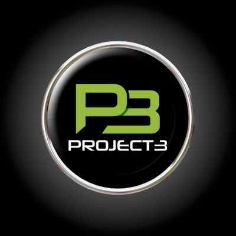

# Logan Buchanan
## About Me
Hello, Im Logan Buchanan and here is a little about myself,
Im a rising Junior at UNC Charlotte majoring in Computer Science
with a concentration in Information Technology
I have experience in JAVASCRIPT and C, Currently Im learning
Python and HTML.
Born and raised in Charlotte, North Carolina where I have an
interest in Gaming, Anime, Music, Lawn Care, and Grilling out
with a Cig and Cold Beer.

### Projects-

## Project 1

## Project 2

## Project 3

## Project 4

